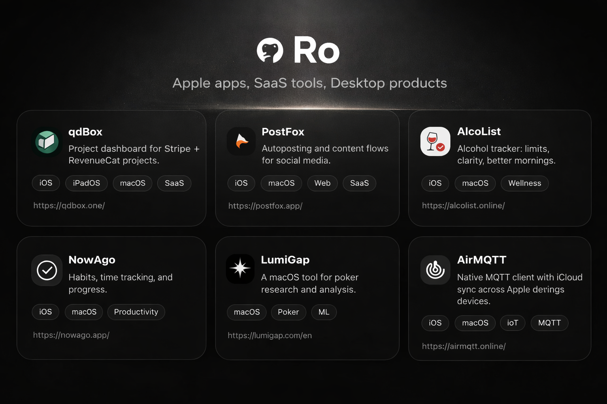

# Stargap

> Apple apps, SaaS tools, and desktop products.

Stargap is a portfolio of Apple apps, SaaS tools, and focused desktop products.

This GitHub profile is used as a public portfolio and documentation hub for Stargap products. Most repositories here are public showcase repos: product pages with documentation, screenshots, links, and lightweight release notes rather than public source code.

## Main projects

### AlcoList
Alcohol tracker focused on limits, clarity, and better mornings.  
**Links:** [Stargap](https://stargap.one/products/alcolist) · [Repo](https://github.com/roqd-one/alcolist) · [Website](https://alcolist.online/) · [App Store](https://apps.apple.com/es/app/alcolist-alcohol-tracker/id6756630744)

### AirMQTT
Native MQTT client for macOS, iPhone, and iPad. Built for monitoring topics, publishing messages, filtering streams, and fast MQTT workflows.  
**Links:** [Stargap](https://stargap.one/products/airmqtt) · [Repo](https://github.com/roqd-one/airmqtt-app) · [Website](https://airmqtt.online/) · [App Store](https://apps.apple.com/es/app/airmqtt/id6745257530)

### NowAgo
Habit and quit tracking for Apple devices, built around a simple and calm workflow.  
**Links:** [Stargap](https://stargap.one/products/nowago) · [Repo](https://github.com/roqd-one/nowago) · [Website](https://nowago.app/) · [App Store](https://apps.apple.com/es/app/nowago-habit-quit-tracker/id6744716317)

### qdBox
Finance and operations dashboard for indie developers and SaaS founders. Tracks revenue, MRR, subscriptions, projects, tasks, domains, and infrastructure.  
**Links:** [Stargap](https://stargap.one/products/qdbox) · [Repo](https://github.com/roqd-one/qdbox-app) · [Website](https://qdbox.one/) · [App Store](https://apps.apple.com/es/app/qdbox-projects-revenue/id6758437065)

### StoreProof
Receipt, warranty, and purchase proof manager for iPhone, iPad, and Mac. Keeps receipts, return windows, warranties, serial numbers, and attachments organized with private iCloud sync.  
**Links:** [Stargap](https://stargap.one/products/storeproof) · [Repo](https://github.com/roqd-one/storeproof-app) · [Website](https://storeproof.one/) · [App Store](https://apps.apple.com/app/storeproof-receipt-tracker/id6772560088)

### PostFox
Autoposting and content workflows for social media. Designed to reduce routine publishing work and support more structured content operations.  
**Links:** [Stargap](https://stargap.one/products/postfox) · [Repo](https://github.com/roqd-one/postfox) · [Website](https://postfox.app/) · [App Store](https://apps.apple.com/es/app/postfox/id6754407815)

### LumiGap
macOS tool for poker research and analysis.  
**Links:** [Stargap](https://stargap.one/products/lumigap) · [Repo](https://github.com/roqd-one/lumigap-poker-ai) · [Website](https://lumigap.com/en)

## What you’ll find here

Each project repository usually includes:
- a product overview
- screenshots
- platform and availability info
- release notes / changelog structure
- public-facing documentation
- links to the official site or App Store page

## Notes

- Source code for commercial products is generally private.
- Public repositories are used here as product showcase pages, lightweight docs, and portfolio entries.
- For product updates, release notes, and links, start with the project READMEs.
